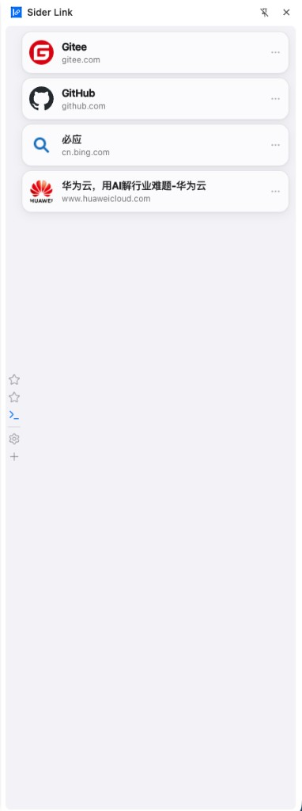
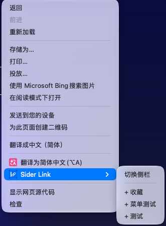
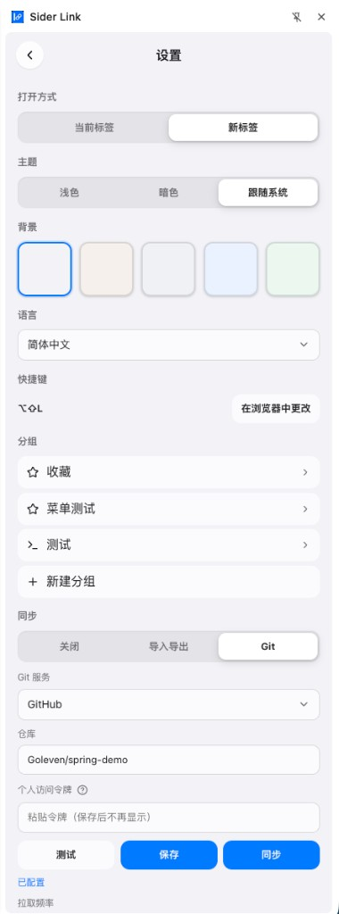

# Sider Link 使用教程

Sider Link 是面向 Chrome / Edge 等 Chromium 浏览器的**侧边栏链接管理**扩展：按分组收藏常用网址，支持右键快速添加、侧栏内搜索、主题与多语言，以及导入导出或通过 Git 跨设备同步。

完整功能以本教程与当前扩展版本为准。



---

## 1. 安装与打开

### 1.1 加载扩展

你需要一份已构建好的扩展目录（通常是仓库里的 `dist/`，或由开发者提供的解压包）。

1. 打开 Chrome 或 Edge，进入 **扩展程序** 管理页  
   - Chrome：地址栏输入 `chrome://extensions`  
   - Edge：地址栏输入 `edge://extensions`
2. 打开右上角 **开发者模式**
3. 点击 **加载已解压的扩展程序**
4. 选择扩展目录（例如 `dist/`）
5. 确认列表中出现 **Sider Link**

> 应用商店上架后可改为从商店安装；目前请使用上述「加载已解压」方式。

### 1.2 打开侧边栏

任选其一：

| 方式 | 操作 |
| --- | --- |
| 工具栏图标 | 点击浏览器工具栏上的 **Sider Link** 图标 |
| 快捷键 | Mac：`⌥⇧L`；Windows / Linux：`Alt+Shift+L`（可在浏览器快捷键页修改） |
| 右键菜单 | 在网页上右键 → **Sider Link** → **切换侧栏** |

再次执行「切换侧栏」或关闭侧栏面板即可隐藏。

### 1.3 全局搜索收藏

不依赖侧栏是否打开。默认快捷键：Mac：`⌥⇧K`；Windows / Linux：`Alt+Shift+K`。

会在工具栏扩展图标旁打开搜索浮层（Action Popup）：默认按侧栏顺序列出全部收藏，输入关键词可按标题或网址过滤；选中后按设置的打开方式打开链接。点击浮层外的浏览器区域（或按 Esc）即可关闭。工具栏图标本身仍用于打开侧栏。可在设置页或 `chrome://extensions/shortcuts` 修改快捷键。

---

## 2. 侧栏主界面

侧栏主要显示**当前选中分组**下的收藏列表（不是一次展示全部分组）。

### 2.1 左侧 IndexBar

侧栏左侧有一条竖直 **IndexBar**（索引栏）：

- **上方**：各分组图标，点击可切换当前分组
- **分隔线下方**（由上到下）：
  - **搜索** — 打开搜索浮层
  - **设置** — 进入设置页
  - **添加** — 打开「添加收藏」表单

鼠标悬停在图标上时，图标会放大并显示名称提示（若系统开启「减少动态效果」，则不会放大）。

### 2.2 收藏列表

- 点击某一行：按设置中的「打开方式」打开链接（新标签或当前标签）
- 当前分组没有任何收藏时，显示「无数据」一类提示
- 在列表顶部或底部继续滚动，可切换到相邻分组

### 2.3 存储异常

若本地数据读取失败，侧栏顶部可能出现提示条，可按提示重试。

---

## 3. 管理收藏

### 3.1 添加收藏

1. 点击 IndexBar 底部的 **添加**（加号）
2. 打开时一般会预填**当前标签页**的标题、网址与图标地址；也可点「收藏当前页」重新填充
3. 按需修改：
   - **标题**
   - **网址**
   - **图标地址**（Logo URL）：左侧有实时预览；留空则列表中显示地球占位图标；加载失败时同样回退为地球图标
   - **分组**
4. 点击添加完成

部分系统页（如 `chrome://`、浏览器内部页）无法被自动读取，此时可手动填写标题和网址。

### 3.2 编辑收藏

1. 将鼠标移到收藏行右侧，打开 **更多（⋯）** 菜单
2. 选择 **编辑**
3. 可修改标题、网址、图标地址、所属分组
4. 保存

### 3.3 删除收藏

- 在行菜单中选择 **删除**，或在编辑表单中删除
- 确认后出现短暂 Toast，可在约 **5 秒内撤销**

### 3.4 拖拽排序

在主列表中按住收藏行拖动，可调整**当前分组内**的顺序。打开设置页时，主列表拖拽会暂时禁用。

---

## 4. 搜索

需要快速打开某个收藏时，不必先切换分组。

### 4.1 打开搜索

任选其一（焦点不在输入框内、且未处于设置页）：

- IndexBar 上的 **搜索** 图标
- 键盘 `/`
- `⌘K`（Mac）或 `Ctrl+K`（Windows / Linux）

打开后输入框会清空并自动聚焦。

### 4.2 使用搜索

- 按标题或网址（含域名）做**不区分大小写**的包含匹配
- 标题命中优先于仅网址命中
- 最多显示 **5** 条结果（无「还有更多」提示）
- 未输入时不会列出全部收藏，仅提示输入关键词
- `↑` / `↓` 移动高亮，`Enter` 或点击结果：打开链接并关闭浮层
- `Esc` 或点击遮罩：关闭；**不会**改变当前分组与列表滚动位置

搜索不会写入查询历史。

---

## 5. 分组

在 **设置 → 分组** 中管理。

### 5.1 新建与编辑

- **新建分组**：填写名称，并选择图标（精选图标，也可搜索更多图标）
- **编辑分组**：点击分组进入，可改名、换图标
- **排序**：在设置页的分组列表中拖拽调整顺序

创建成功后，侧栏会选中新建的分组。

### 5.2 默认分组与删除

- **默认分组**可以改名，**不能删除**
- 删除其他分组时需确认；该组内的收藏会**迁入默认分组**（此操作没有撤销 Toast）

---

## 6. 右键菜单

在普通网页上右键，展开 **Sider Link**：



1. **切换侧栏** — 显示或隐藏侧边栏  
2. 分隔线  
3. 每个分组一项 **`+ 分组名`** — 将**当前页**直接加入该分组（使用当前页的标题、网址与图标）

添加成功或失败时，浏览器可能弹出系统通知。

**受限页面**（如 `chrome://`、部分扩展页）无法作为收藏来源时，会通过通知提示；请改用侧栏「添加」手动填写。

---

## 7. 设置

点击 IndexBar 的 **设置** 进入。



| 项 | 说明 |
| --- | --- |
| 打开链接 | **新标签** 或 **当前标签** |
| 主题 | 浅色 / 暗色 / 跟随系统 |
| 背景 | 若干背景色预设 |
| 语言 | 简体中文 / 繁體中文 / English / 日本語 |
| 快捷键 | 显示当前「切换侧栏」快捷键；可跳转到浏览器快捷键页修改 |
| 分组 | 见上文「分组」 |
| 同步 | 见下文「同步」 |

---

## 8. 同步

在 **设置 → 同步** 中选择模式。

| 模式 | 说明 |
| --- | --- |
| 关闭 | 数据仅保存在本机（`chrome.storage.local`） |
| 导入导出 | 下载 / 上传 JSON 备份 |
| Git | 使用你自己的私有仓库 + **Personal Access Token（PAT）**，支持 GitHub / Gitee / GitLab |

### 8.1 导入导出

- **导出**：下载当前全部收藏与界面设置为 JSON  
- **导入**：上传 JSON 前会确认；确认后**整库覆盖**本机数据（含设置）

Personal Access Token **不会**出现在导出文件中。

### 8.2 Git 同步

1. 选择服务商（GitHub / Gitee / GitLab）
2. 填写仓库，格式一般为 `所有者/仓库名`
3. 粘贴具有读写权限的 PAT（保存后界面不再回显完整令牌）
4. 使用 **测试** 验证能否访问仓库；**保存** 以连接
5. 高级选项中可改远程文件路径（默认 `data/favorites.json`）与分支

**令牌只存在本机同步配置里**，不会写入导出文件，也不会写入推送到仓库的 JSON。

#### 拉取频率

| 选项 | 行为 |
| --- | --- |
| 人工同步 | **不会**自动拉取或推送；下方出现 **拉取** / **推送** 按钮 |
| 仅激活时 | 打开侧栏时尝试拉取；本地改动约 3 秒后防抖推送 |
| 每 15 / 30 / 60 分钟 | 在「仅激活时」行为之外，按间隔用后台闹钟拉取 |

非「人工同步」时还可使用 **同步** 按钮：按整文件 **最后写入获胜（last-write-wins）** 比较本地与远端的 `meta.updatedAt`，决定拉取或推送。

#### 人工同步下的拉取 / 推送

- **拉取**：以仓库为准，用远端文件**覆盖**本地（不比较时间戳）  
- **推送**：以本地为准，把本地配置**覆盖**写入仓库  

若远端尚无文件，拉取可能提示仓库中还没有文件；推送会创建或更新该文件。

---

## 9. 常见问题

**Q：右键添加失败，或提示无法收藏？**  
A：当前页可能是浏览器内部页或受限地址。请打开侧栏 → 添加，手动填写标题和网址。

**Q：导入后原来的数据没了？**  
A：导入会整库覆盖。导入前请先导出一份备份。

**Q：Git「人工同步」和「同步」有什么区别？**  
A：人工同步关闭所有自动同步，只用强制 **拉取**（远端覆盖本地）或 **推送**（本地覆盖远端）。「同步」按钮走时间戳比较的 LWW，只在非人工频率下显示。

**Q：收藏图标变成地球？**  
A：未设置图标地址，或图片地址加载失败时，会显示地球占位图标。可在编辑中填写可用的图标 URL。

**Q：如何改快捷键？**  
A：设置页中打开浏览器快捷键页，或手动访问 `chrome://extensions/shortcuts`（Edge 为 `edge://extensions/shortcuts`），找到 Sider Link 的「切换侧栏」或「搜索收藏」进行修改。

**Q：搜索找不到刚加的收藏？**  
A：确认关键词出现在标题或网址中；结果最多 5 条，可换更具体的关键词。

---

## 附录：给开发者

若你从源码构建扩展：

```bash
pnpm install   # 或 npm install
pnpm test
pnpm build     # 产出 dist/
pnpm dev       # 开发热更新；浏览器仍加载产物目录（一般为 dist）
```

环境要求：支持 Manifest V3 + Side Panel 的 Chromium 浏览器，以及 Node.js 与包管理器（推荐 [pnpm](https://pnpm.io)）。

设计说明见：

- [`superpowers/specs/2026-07-24-favorites-sidepanel-design.md`](superpowers/specs/2026-07-24-favorites-sidepanel-design.md)
- [`superpowers/specs/2026-07-31-git-sync-design.md`](superpowers/specs/2026-07-31-git-sync-design.md)
- [`superpowers/specs/2026-08-01-bookmark-search-design.md`](superpowers/specs/2026-08-01-bookmark-search-design.md)
